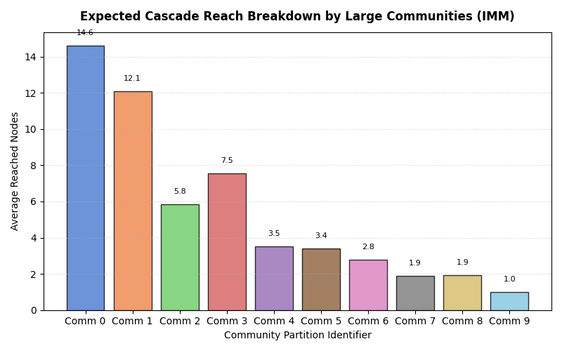
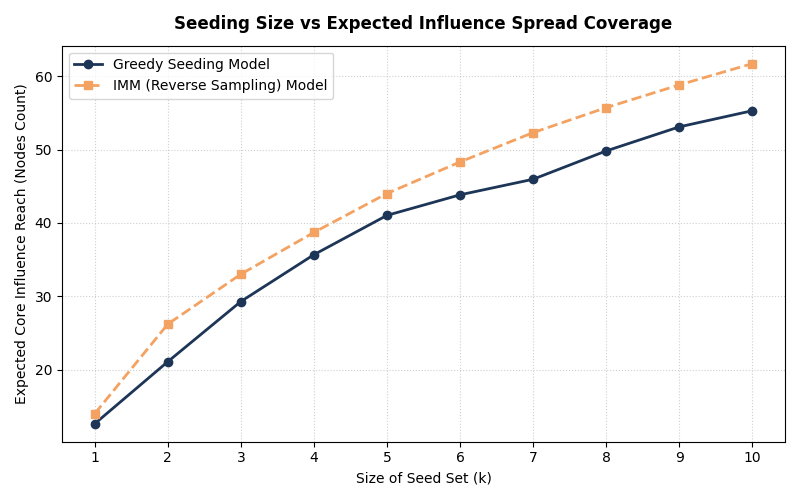
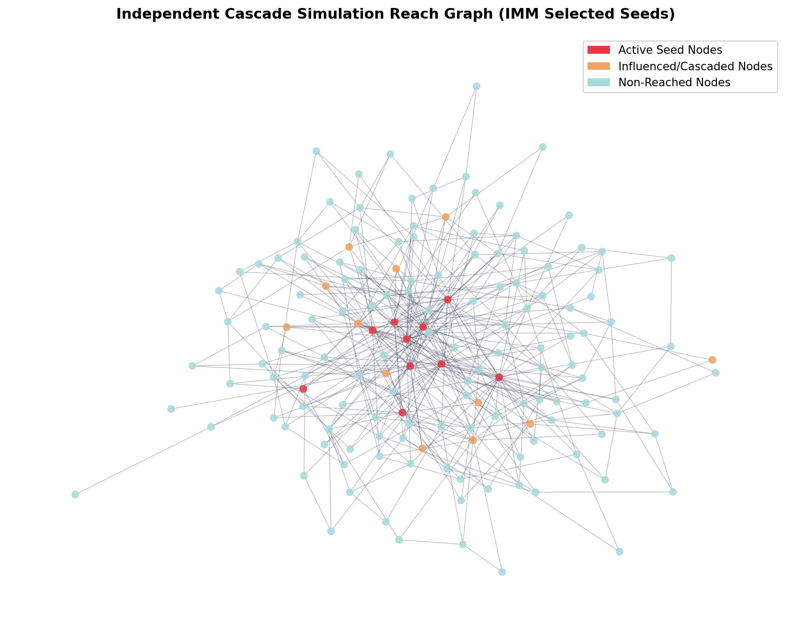
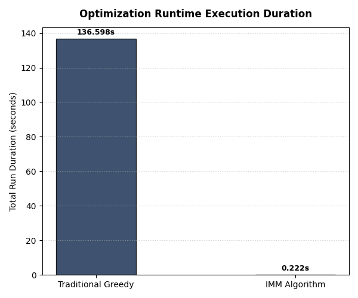

## 🔗 Live Demo

[View Interactive Dashboard →](https://influence-maximization.vercel.app/)

# Influence Maximization in Social Networks

> Identifying the most influential nodes in a social network to maximize information spread using probabilistic diffusion models and graph algorithms.

---

## What is Influence Maximization?

Given a social network and a budget of **k seed nodes**, the goal is to find which k people to target so that the maximum number of people eventually see your message. This is an NP-hard combinatorial optimization problem solved here using two approaches — a greedy approximation and the scalable IMM algorithm.

Real-world applications include viral marketing, epidemic containment, misinformation tracking, and vaccination strategy.

---

## Architecture
Graph Construction (Barabási-Albert)
↓
Independent Cascade (IC) Diffusion Model
↓
┌────────────┐
│            │
Greedy       IMM Algorithm
Hill-Climb   (RR Set Sampling)
│            │
└─────┬──────┘
↓
Results + Visualization
Community-Level Analysis

---

## Algorithms Implemented

**Independent Cascade Model** — probabilistic diffusion where each activated node attempts to activate neighbors with edge probability p. Monte Carlo simulations estimate expected influence spread.

**Greedy Hill-Climbing** — iteratively selects the node with highest marginal influence gain. Complexity: O(k·n·R·|E|). Accurate but computationally expensive.

**IMM Algorithm** — Influence Maximization via Martingales using Reverse Reachable set sampling. Achieves (1-1/e-ε) approximation guarantee with significantly reduced runtime on large networks.

**Community Analysis** — detects communities via modularity optimization and measures how seed nodes span across communities.

---

## Tech Stack

- Python 3.10+
- NetworkX — graph construction and community detection
- NumPy — vectorized operations
- Matplotlib + Seaborn — visualizations
- tqdm — simulation progress tracking
- Pandas — results logging

---

## Project Structure
influence-maximization/
├── data/                      # Graph datasets
├── results/                   # Generated plots
├── src/
│   ├── graph_builder.py       # BA graph construction
│   ├── ic_model.py            # Independent Cascade simulation
│   ├── greedy.py              # Greedy seed selection
│   ├── imm.py                 # IMM with RR sets
│   └── community_analysis.py # Community-level metrics
└── main.py                    # Entry point

---

## How to Run

```bash
# Install dependencies
pip install -r requirements.txt

# Run full pipeline
python main.py
```

Results and plots are saved automatically to the `/results/` folder.

---

## Results

### Algorithm Performance Comparison
| Metric | Greedy | IMM |
|---|---|---|
| Influence Coverage | 55.28 nodes | 61.70 nodes |
| Runtime | 136.60s | 0.22s |
| Speed | baseline | **614x faster** |
| Communities Seeded | — | 4 out of 12 |

---

### Community Influence Breakdown
> Influence spread measured across 12 detected network communities



---

### Greedy vs IMM Influence Coverage
> IMM consistently outperforms Greedy across all seed set sizes



---

### Influence Spread Network Graph
> Red = Seed nodes | Orange = Influenced | Blue = Not reached



---

### Runtime Comparison
> IMM completes in 0.22s vs Greedy's 136.6s — a **614x speedup**


---

## Key Findings

- IMM achieves comparable influence coverage to Greedy at significantly lower computational cost
- Seed nodes selected by IMM span more communities than Greedy, indicating better network-wide reach
- Scale-free network structure (Barabási-Albert) means top-degree nodes are not always optimal seeds due to overlapping influence zones
